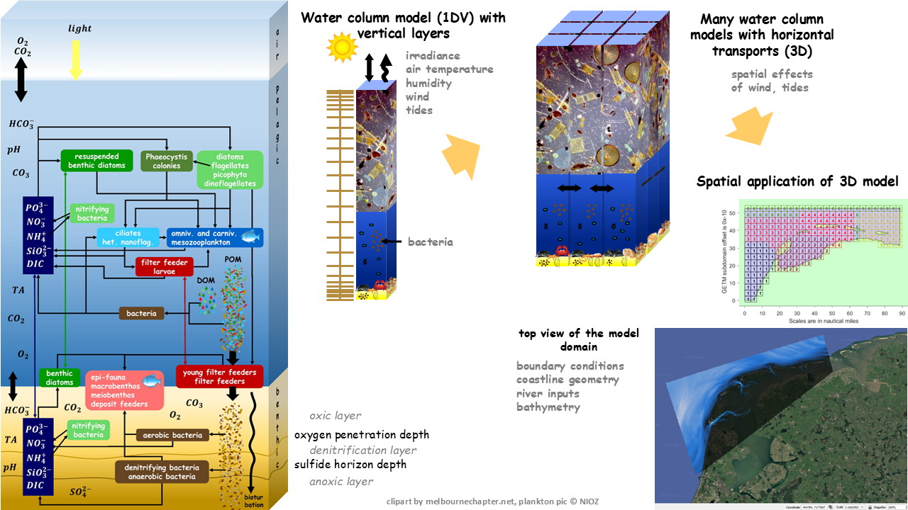
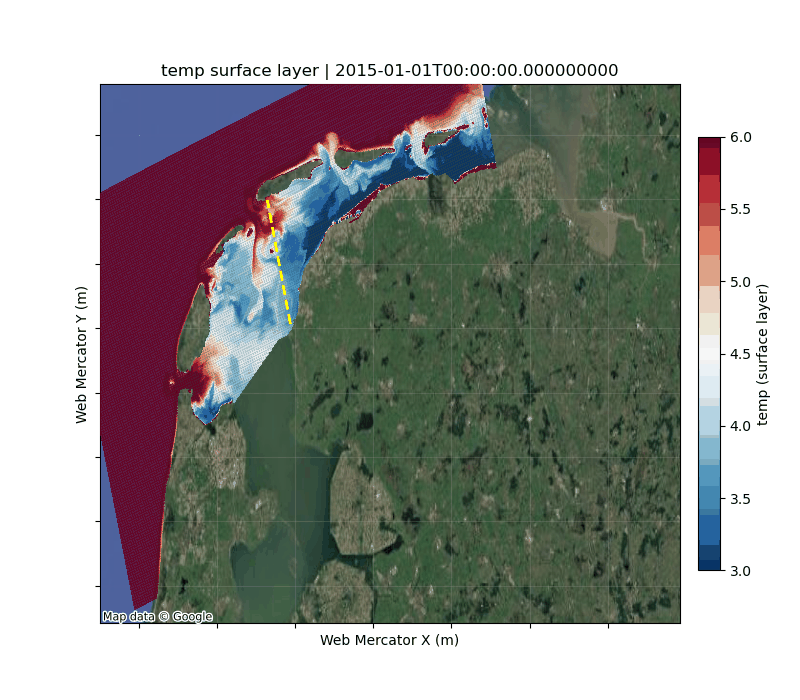
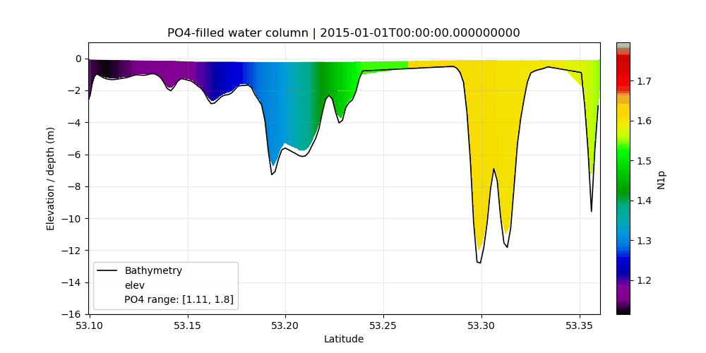

# 3D_models_WaddenSea
This repository document the setup of 3D GETM-BFM models for the Wadden Sea

## Model schemma

## Model 3d example outputs
- Top view:

- Transect view:

## Update target branch using resource from other branches
### new git version
- git fetch origin
- git switch target_brach_name
- git restore --source origin/source_branch_name --staged --worktree ./dws_500m/
- git commit -m "Bring dws_500m from source_branch_name"

### Cluster git version (1.8.3.1)
- git fetch origin
- git checkout target_brach_name
- git checkout origin/source_branch_name ./dws_500m/
- git commit -m "Bring dws_500m from source_branch_name"

## Merging branches into main
- git checkout main 
- git pull origin main 
- git merge <your_branch> git push origin main

## Estimated Technical Requirements:
- GPU: not needed
- Cores: 240 CPUs (scalability to 1000-2000 cores tbt)
- Memory: sufficient, no issues expected
- Disk size: for exploratory runs: 1–5 TB; for serious simulations: 5–10 TB

## Model input/output processing:
- still private repository, pls contact Qing Zhan (qing.zhan@nioz.nl)

